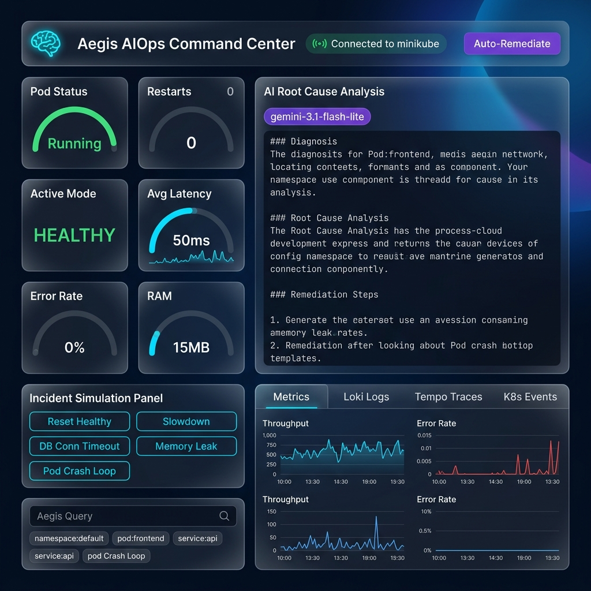
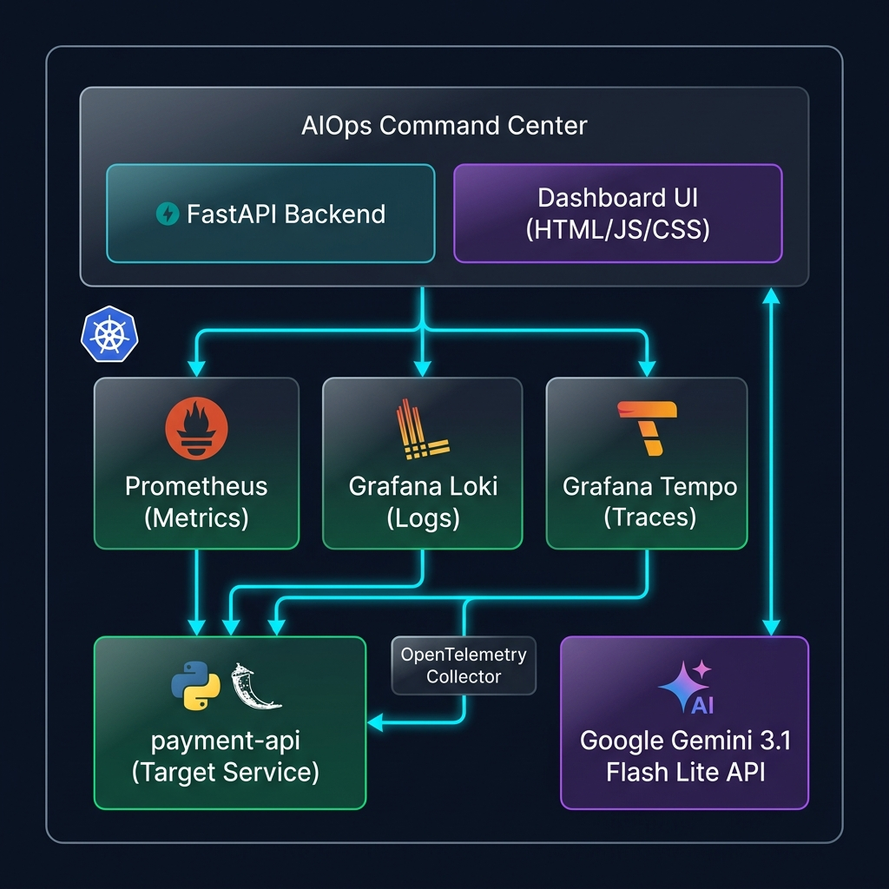

<](https://kubernetes.io/)
[](https://minikube.sigs.k8s.io/)
[](https://python.org/)
[](https://fastapi.tiangolo.com/)
[](https://ai.google.dev/)
[](https://prometheus.io/)
[](https://grafana.com/)
[](LICENSE)

<br/>

> _"Don't just monitor. Understand. Diagnose. Remediate — automatically."_

<br/>



<br/>

**Aegis** is a full-stack AIOps platform that unifies real-time observability with AI-driven incident intelligence. It collects metrics, logs, traces, and Kubernetes events from a live microservice, then uses **Google Gemini 3.1 Flash Lite** to perform expert-level root cause analysis — all from a single glassmorphism dashboard.

<br/>

[🚀 Quick Start](#-quick-start) · [📖 Features](#-features) · [🏗️ Architecture](#️-architecture) · [🎭 Simulations](#-incident-simulation-scenarios) · [📡 API Reference](#-api-reference) · [🛠️ Troubleshooting](#️-troubleshooting)

</div>

---

## 📖 Features

<table>
<tr>
<td width="50%">

### 📊 Real-Time Observability
- **Prometheus Metrics** — Request rate, error rate, P50 latency, CPU & memory usage scraped every 5s
- **Grafana Loki Logs** — Live stdout log aggregation with keyword filtering (error, timeout, fail)
- **Grafana Tempo Traces** — Distributed tracing with OpenTelemetry spans visualized as Gantt charts
- **Kubernetes Events** — Pod lifecycle events, restarts, OOM kills, CrashLoopBackOff detection

</td>
<td width="50%">

### 🤖 AI-Powered Intelligence
- **Gemini 3.1 Flash Lite** — Cloud-based LLM for expert SRE analysis
- **Context-Aware Diagnosis** — AI receives metrics + logs + traces + K8s events as unified context
- **Structured Output** — Markdown-formatted diagnosis, root cause analysis, and remediation steps
- **Graceful Fallback** — Rule-based heuristics when AI is unavailable

</td>
</tr>
<tr>
<td width="50%">

### 🎭 Chaos Engineering
- **5 Incident Modes** — Healthy, Slowdown, DB Error, Memory Leak, Pod Crash
- **One-Click Triggers** — Simulate production failures instantly from the dashboard
- **Auto-Queried AI** — Each simulation automatically triggers AI analysis
- **Real Telemetry Impact** — Simulations affect actual Prometheus metrics and Loki logs

</td>
<td width="50%">

### 🔧 Auto-Remediation
- **Rolling Restart** — Kubernetes-native deployment restart via the K8s API
- **State Reset** — Automatically resets simulation mode to healthy
- **RBAC-Secured** — Dedicated ServiceAccount with minimal required permissions
- **One-Click Fix** — Single button to remediate and restore service health

</td>
</tr>
</table>

---

## 🏗️ Architecture

<div align="center">

</div>

<br/>

### How It Works

```
User clicks "Simulate DB Error" on Dashboard
       │
       ▼
┌─────────────────────────────────────────────────────────────────────────┐
│  1. SIMULATE  │  POST /api/simulate/db_error → payment-api             │
│               │  payment-api begins returning 500s + error logs         │
├───────────────┼─────────────────────────────────────────────────────────┤
│  2. COLLECT   │  Command Center scrapes:                                │
│               │  ├── Prometheus → error_rate spike, latency increase    │
│               │  ├── Loki → "ConnectionRefusedError", stack traces      │
│               │  ├── Tempo → failed spans with DB timeout               │
│               │  └── K8s API → Warning events, restart counts           │
├───────────────┼─────────────────────────────────────────────────────────┤
│  3. ANALYZE   │  All telemetry bundled into a structured prompt         │
│               │  → Sent to Google Gemini 3.1 Flash Lite API             │
│               │  → Returns markdown: Diagnosis + Root Cause + Fix       │
├───────────────┼─────────────────────────────────────────────────────────┤
│  4. DISPLAY   │  Dashboard renders AI analysis with live telemetry      │
│               │  Charts update in real-time (3.5s polling interval)     │
├───────────────┼─────────────────────────────────────────────────────────┤
│  5. REMEDIATE │  User clicks "Auto-Remediate"                           │
│               │  → Resets simulation state to healthy                   │
│               │  → Triggers kubectl rolling restart via K8s Python API  │
└───────────────┴─────────────────────────────────────────────────────────┘
```

### Tech Stack

| Layer | Technology | Purpose |
|:---:|---|---|
| 🖥️ | **HTML / CSS / JavaScript** | Dashboard UI with glassmorphism design |
| ⚡ | **FastAPI (Python)** | Backend API server & telemetry aggregation |
| 🤖 | **Google Gemini 3.1 Flash Lite** | AI root cause analysis via `google-genai` SDK |
| 📊 | **Prometheus** | Metrics collection (request rate, error rate, latency, CPU, RAM) |
| 📝 | **Grafana Loki** | Log aggregation (stdout scraping from containers) |
| 🔗 | **Grafana Tempo** | Distributed tracing (OpenTelemetry spans) |
| 📡 | **OpenTelemetry** | Instrumentation SDK for traces & metrics export |
| ☸️ | **Kubernetes (Minikube)** | Container orchestration & deployment platform |
| 📈 | **Chart.js** | Real-time metric visualization |
| 📄 | **Marked.js** | Markdown rendering for AI analysis output |

---

## 🚀 Quick Start

### Prerequisites

| Tool | Version | Installation |
|---|---|---|
| Docker | 20+ | [docs.docker.com/get-docker](https://docs.docker.com/get-docker/) |
| Minikube | 1.30+ | [minikube.sigs.k8s.io/docs/start](https://minikube.sigs.k8s.io/docs/start/) |
| kubectl | 1.28+ | [kubernetes.io/docs/tasks/tools](https://kubernetes.io/docs/tasks/tools/) |
| Helm | 3.0+ | [helm.sh/docs/intro/install](https://helm.sh/docs/intro/install/) |
| Gemini API Key | — | [aistudio.google.com/apikey](https://aistudio.google.com/apikey) |

### Step 1: Clone & Configure

```bash
# Clone the repository
git clone https://github.com/humeshdeshmukh/aiops-command-center.git
cd 09-aiops-command-center

# Set your Gemini API key in .env
nano .env
```

Edit the `.env` file with your API key:

```env
GEMINI_API_KEY=your-actual-gemini-api-key-here
GEMINI_MODEL=gemini-3.1-flash-lite
```

### Step 2: Start Minikube

```bash
minikube start --driver=docker --memory=4096 --cpus=2
```

### Step 3: Install Observability Stack

> If you already have Prometheus, Loki, and Tempo installed in your cluster, skip this step.

```bash
# Create observability namespace
kubectl create namespace observability

# Install Prometheus Stack
helm repo add prometheus-community https://prometheus-community.github.io/helm-charts
helm install prometheus-operator prometheus-community/kube-prometheus-stack \
  -n observability --set prometheus.prometheusSpec.serviceMonitorSelectorNilUsesHelmValues=false

# Install Loki
helm repo add grafana https://grafana.github.io/helm-charts
helm install loki grafana/loki-stack -n observability

# Install Tempo
helm install tempo grafana/tempo -n observability
```

### Step 4: Create Kubernetes Secret

```bash
kubectl create secret generic gemini-api-secret \
  --from-literal=api-key="$(grep '^GEMINI_API_KEY=' .env | cut -d '=' -f2)"
```

### Step 5: Build & Deploy

```bash
chmod +x deploy.sh
./deploy.sh
```

### Step 6: Access the Dashboard

```bash
# Option A: Direct NodePort access
echo "http://$(minikube ip):32009"

# Option B: Port forwarding (recommended)
kubectl port-forward svc/command-center-service 8000:8000
# → Open http://localhost:8000
```

---

## 🎭 Incident Simulation Scenarios

The dashboard includes 5 simulation modes to demonstrate AI-driven incident analysis:

### 🟢 Healthy (Default)

| Metric | Expected Value |
|---|---|
| Error Rate | 0% |
| Latency | ~50ms |
| Pod Status | Running |
| Behavior | Normal request processing |

### 🟡 Slowdown (High Latency)

| Metric | Expected Value |
|---|---|
| Error Rate | 0% |
| Latency | ~4,500ms ⚠️ |
| Pod Status | Running |
| Behavior | Simulates slow database queries — 4.5s sleep injected into request path |

**AI Diagnosis:** Identifies thread pool blocking and recommends DB query optimization or connection pool tuning.

### 🔴 Database Connection Error

| Metric | Expected Value |
|---|---|
| Error Rate | 100% 🔴 |
| Latency | ~3,000ms |
| Pod Status | Running |
| Behavior | All requests return 500 with `ConnectionRefusedError` stack traces |

**AI Diagnosis:** Detects connection pool exhaustion, correlates Loki error logs with Prometheus error rate spike.

### 🟠 Memory Leak (OOM)

| Metric | Expected Value |
|---|---|
| Error Rate | 0% |
| Latency | Normal |
| Memory | Rising 📈 (15MB/chunk/1.5s) |
| Behavior | Background thread allocates 15MB chunks until OOM kill |

**AI Diagnosis:** Identifies memory growth pattern, predicts OOM kill, recommends memory limits and leak investigation.

### 💀 Pod Crash Loop

| Metric | Expected Value |
|---|---|
| Error Rate | N/A (service offline) |
| Latency | N/A |
| Pod Status | CrashLoopBackOff 🔴 |
| Behavior | Process exits with code 1, Kubernetes restarts pod repeatedly |

**AI Diagnosis:** Correlates K8s restart events with Loki crash logs, recommends examining exit codes and health probes.

---

## 📡 API Reference

### `GET /api/system-status`

Returns complete system health snapshot.

<details>
<summary><b>Response Example</b></summary>

```json
{
  "status": "UP",
  "target_mode": "healthy",
  "pod_status": "Running",
  "pod_restarts": 0,
  "metrics": {
    "error_rate": 0.0,
    "latency": 0.052,
    "request_rate": 2.5,
    "memory_mb": 15.32,
    "cpu_cores": 0.005
  },
  "logs": [
    "2026-06-05 19:30:01 [INFO] payment-api - Payment processed successfully.",
    "..."
  ],
  "events": [
    {
      "reason": "Pulled",
      "message": "Container image already present",
      "type": "Normal",
      "object": "Pod",
      "count": 1,
      "last_timestamp": "2026-06-05T19:28:00Z"
    }
  ]
}
```
</details>

---

### `POST /api/simulate/{mode}`

Trigger a failure simulation on the target service.

| Parameter | Values |
|---|---|
| `mode` | `healthy`, `slowdown`, `db_error`, `memory_leak`, `crash` |

```bash
curl -X POST http://localhost:8000/api/simulate/db_error
```

---

### `POST /api/analyze`

Perform AI-powered root cause analysis.

```bash
curl -X POST http://localhost:8000/api/analyze \
  -H "Content-Type: application/json" \
  -d '{"query": "Why is payment-api failing?", "service": "payment-api", "namespace": "default"}'
```

<details>
<summary><b>Response Example</b></summary>

```json
{
  "query": "Why is payment-api failing?",
  "analysis": "### Diagnosis\nThe payment-api service is experiencing...\n\n### Root Cause Analysis\n...\n\n### Remediation Steps\n1. ...",
  "telemetry": {
    "metrics": { "error_rate": 1.0, "latency": 3.012 },
    "logs": ["[ERROR] ConnectionRefusedError...", "..."],
    "events": [{ "reason": "BackOff", "..." }]
  }
}
```
</details>

---

### `POST /api/remediate`

Execute automated remediation (rolling restart + state reset).

```bash
curl -X POST http://localhost:8000/api/remediate
```

```json
{
  "status": "SUCCESS",
  "message": "Initiated rolling restart of payment-api deployment and reset state to healthy."
}
```

---

## 📁 Project Structure

```
09-aiops-command-center/
│
├── 📄 .env                          # 🔑 API keys & config (gitignored)
├── 📄 .gitignore                    # Git ignore rules
├── 📄 README.md                     # This documentation
├── 🚀 deploy.sh                     # One-command build & deploy script
├── ☸️  kubernetes.yaml               # All K8s manifests (RBAC, Deployments, Services, ServiceMonitor)
│
├── 🧠 command-center/               # AIOps Command Center
│   ├── 🐳 Dockerfile                # Python 3.10-slim container
│   ├── 🐍 main.py                   # FastAPI backend — telemetry aggregation + Gemini AI
│   ├── 📦 requirements.txt          # Python dependencies (fastapi, google-genai, kubernetes, etc.)
│   └── 🌐 static/                   # Frontend dashboard
│       ├── index.html                # Dashboard layout & structure
│       ├── style.css                 # Glassmorphism dark theme (781 lines)
│       └── script.js                 # Real-time charts, API calls, WebSocket-like polling
│
├── 💳 payment-api/                   # Target microservice (chaos simulation target)
│   ├── 🐳 Dockerfile                # Python 3.10-slim container
│   ├── 🐍 main.py                   # FastAPI + Prometheus metrics + OpenTelemetry tracing
│   └── 📦 requirements.txt          # Python dependencies (prometheus-client, opentelemetry, etc.)
│
└── 📁 docs/
    └── 📁 images/                    # README assets
        ├── dashboard-preview.png
        └── architecture-diagram.png
```

---

## ⚙️ Configuration Reference

### Environment Variables

| Variable | Required | Default | Description |
|:---|:---:|---|---|
| `GEMINI_API_KEY` | ✅ | — | Google Gemini API key ([get one here](https://aistudio.google.com/apikey)) |
| `GEMINI_MODEL` | ❌ | `gemini-3.1-flash-lite` | Gemini model identifier |
| `PROMETHEUS_URL` | ❌ | `http://prometheus-operator-kube-p-prometheus.observability.svc.cluster.local:9090` | Prometheus server endpoint |
| `LOKI_URL` | ❌ | `http://loki.observability.svc.cluster.local:3100` | Loki log aggregator endpoint |
| `TEMPO_URL` | ❌ | `http://tempo.observability.svc.cluster.local:3200` | Tempo trace backend endpoint |
| `TARGET_SERVICE_URL` | ❌ | `http://payment-api-service.default.svc.cluster.local:5000` | Target microservice endpoint |

### Kubernetes Resources

| Resource | Name | Namespace |
|---|---|---|
| ServiceAccount | `command-center-sa` | default |
| Role | `command-center-role` | default |
| RoleBinding | `command-center-rb` | default |
| Deployment | `command-center` | default |
| Deployment | `payment-api` | default |
| Service | `command-center-service` (NodePort 32009) | default |
| Service | `payment-api-service` (ClusterIP 5000) | default |
| ServiceMonitor | `payment-api-monitor` | default |
| Secret | `gemini-api-secret` | default |

---

## 🛠️ Troubleshooting

<details>
<summary><b>🔴 Gemini API returns errors</b></summary>

1. Verify your API key is correct in `.env`:
   ```bash
   grep GEMINI_API_KEY .env
   ```
2. Ensure the K8s secret matches:
   ```bash
   kubectl get secret gemini-api-secret -o jsonpath='{.data.api-key}' | base64 -d
   ```
3. Test the API key directly:
   ```bash
   curl "https://generativelanguage.googleapis.com/v1beta/models?key=YOUR_KEY"
   ```
4. Check [Google AI Studio](https://aistudio.google.com/apikey) for quota/billing issues

The app gracefully falls back to rule-based heuristics if the API is unreachable.

</details>

<details>
<summary><b>🔴 Pod stuck in CreateContainerConfigError</b></summary>

This usually means the `gemini-api-secret` Kubernetes secret is missing:

```bash
# Create the secret
kubectl create secret generic gemini-api-secret \
  --from-literal=api-key="$(grep '^GEMINI_API_KEY=' .env | cut -d '=' -f2)"

# Restart the deployment
kubectl rollout restart deployment/command-center
```

</details>

<details>
<summary><b>🟡 Metrics showing 0 or default values</b></summary>

1. Check ServiceMonitor is active:
   ```bash
   kubectl get servicemonitor payment-api-monitor
   ```
2. Verify Prometheus is scraping the target:
   ```bash
   kubectl port-forward svc/prometheus-operator-kube-p-prometheus 9090:9090 -n observability
   # Visit http://localhost:9090/targets
   ```
3. Ensure the `release: prometheus-operator` label matches your Helm release name

</details>

<details>
<summary><b>🟡 Logs not appearing in Loki</b></summary>

1. Verify Loki is running:
   ```bash
   kubectl get pods -n observability -l app=loki
   ```
2. Check Promtail/log collection agent is deployed and scraping container stdout
3. Test Loki query directly:
   ```bash
   curl "http://localhost:3100/loki/api/v1/query_range?query={container=\"payment-api\"}&limit=5"
   ```

</details>

<details>
<summary><b>🟡 Deploy script fails at Step 1</b></summary>

Minikube is not running:
```bash
minikube status          # Check status
minikube start           # Start cluster
./deploy.sh              # Re-run deploy
```

</details>

<details>
<summary><b>🔴 Command Center pod is CrashLoopBackOff</b></summary>

Check the logs for startup errors:
```bash
kubectl logs deployment/command-center --tail=50
kubectl describe pod -l app=command-center
```

Common causes:
- Missing Python dependencies → Rebuild the Docker image
- Invalid environment variables → Check secret and ConfigMap
- Port conflict → Ensure port 8000 is available

</details>

---

## 🤝 Contributing

Contributions are welcome! Please:

1. Fork the repository
2. Create a feature branch (`git checkout -b feature/amazing-feature`)
3. Commit your changes (`git commit -m 'Add amazing feature'`)
4. Push to the branch (`git push origin feature/amazing-feature`)
5. Open a Pull Request

---

## 📜 License

This project is open source and available under the [MIT License](LICENSE).

---

<div align="center">

**Built with ❤️ for the DevOps & SRE community**

<sub>Powered by Google Gemini · Kubernetes · Prometheus · Grafana Loki · Grafana Tempo · OpenTelemetry</sub>

</div>
]]>
